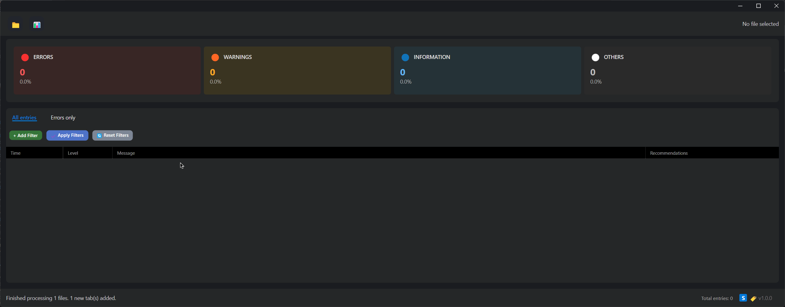

# Log Parser App 🚀

[View Latest Releases](https://github.com/BlessedDayss/Log_Parser_App/releases)

A powerful, enterprise-grade desktop application designed to parse, analyze, and visualize complex log files from multiple sources. Transform raw log data into actionable insights with advanced error detection, multi-format support, and intelligent recommendations!

## ✨ Key Features

### 📂 **Multi-Format Log Support**
- **Standard Logs:** Traditional application logs with timestamps, levels, and messages
- **IIS Web Server Logs:** Full support for IIS log format parsing and analysis
- **RabbitMQ Message Logs:** Specialized parsing for RabbitMQ message queue logs
- **Automatic Format Detection:** Intelligent detection of log formats for seamless processing

### 🧠 **Advanced Error Detection & Analysis**
- **Intelligent Error Detection:** Multi-strategy error detection system with format-specific analyzers
- **Error Pattern Recognition:** Advanced pattern matching for common error scenarios
- **Stack Trace Analysis:** Comprehensive stack trace parsing and visualization
- **Error Categorization:** Automatic classification of errors by severity and type
- **Performance Impact Analysis:** Correlation between errors and system performance metrics

### 📊 **Comprehensive Analytics Dashboard**
- **Real-time Statistics:** Live metrics for total entries, error rates, and performance indicators
- **Interactive Visualizations:**
  - Log Type Distribution (Pie Charts)
  - Error Trends Over Time (Line Charts)
  - Activity Heat Maps for temporal analysis
  - Top Error Messages frequency analysis
  - Performance bottleneck identification
- **Custom Chart Configurations:** Configurable time ranges and data aggregation

### 🔍 **Advanced Filtering & Search**
- **Multi-criteria Filtering:** Dynamic filter combinations with AND/OR logic
- **Pattern-based Search:** Regular expression and wildcard support
- **Real-time Filter Application:** Instant results as you type
- **Saved Filter Presets:** Save and reuse complex filter configurations
- **Cross-tab Filtering:** Apply filters across multiple open log files

### 🎨 **Modern UI & User Experience**
- **Multi-Tab Interface:** Concurrent analysis of multiple log files
- **Responsive Design:** Optimized for different screen sizes and resolutions
- **Theme Customization:** Light/Dark themes with custom color schemes
- **Accessibility Features:** Keyboard shortcuts and screen reader support
- **Drag & Drop Support:** Easy file loading via drag and drop

### ⚡ **Performance & Scalability**
- **Asynchronous Processing:** Non-blocking UI with background log processing
- **Memory Optimization:** Efficient memory usage for large log files (GB+ support)
- **Caching System:** Intelligent caching for faster repeated operations
- **Batch Processing:** Optimized processing of multiple files simultaneously
- **Performance Benchmarking:** Built-in performance testing and monitoring

### 🔄 **Auto-Update System**
- **Automatic Updates:** Seamless background updates from GitHub releases
- **Configurable Update Policy:** Control update frequency and notification preferences
- **Version Management:** Track version history and rollback capabilities
- **Update Notifications:** Non-intrusive update notifications

### 💡 **Intelligent Recommendations**
- **Error Resolution Suggestions:** Context-aware recommendations for common errors
- **Best Practices Guidance:** Suggestions for log analysis workflows
- **Performance Optimization Tips:** Recommendations for improving system performance
- **Configurable Recommendation Engine:** Customizable via `error_recommendations.json`

### 🔧 **Enterprise Features**
- **File Association Management:** Register as default handler for log file types
- **Command Line Interface:** Batch processing and automation support
- **Configuration Management:** Centralized settings via `appsettings.json`
- **Extensible Architecture:** Plugin-ready design for custom log formats
- **Data Export:** Export filtered results and analytics to various formats

---



---

## 🛠️ Tech Stack

- **C# (.NET 9)**: Core application logic with modern language features
- **Avalonia UI 11.2+**: Cross-platform, modern UI framework
- **LiveChartsCore 2.0**: Advanced charting and data visualization
- **CommunityToolkit.Mvvm**: MVVM pattern implementation
- **Microsoft.Extensions.DependencyInjection**: Dependency injection container
- **NLog 5.0**: Comprehensive logging framework
- **BenchmarkDotNet**: Performance testing and optimization

## 🚀 Getting Started

### Prerequisites

- [.NET 9 SDK](https://dotnet.microsoft.com/download/dotnet/9.0) or later
- Windows 10/11, macOS 10.15+, or Linux (Ubuntu 18.04+)
- Minimum 4GB RAM (8GB recommended for large log files)
- 500MB available disk space

### Quick Start

1. **Clone and Build:**
   ```bash
   git clone https://github.com/BlessedDayss/Log_Parser_App.git
   cd Log_Parser_App
   dotnet build -c Release
   ```

2. **Run the Application:**
   ```bash
   # Standard launch
   .\bin\Release\net9.0\Log_Parser_App.exe
   
   # Open specific log file
   .\bin\Release\net9.0\Log_Parser_App.exe "C:\logs\application.log"
   
   # Performance testing mode
   .\bin\Release\net9.0\Log_Parser_App.exe --perf-test
   ```

### Command Line Options

```bash
# Open specific file on startup
Log_Parser_App.exe "path/to/logfile.txt"

# Run performance benchmarks
Log_Parser_App.exe --perf-test

# Test parsing functionality
Log_Parser_App.exe --test-parsing
```

## 📖 Usage Guide

### 1. **Loading Log Files**
- **Single Files:** Use "Open File(s)" button or drag & drop
- **Directories:** "Open Directory" loads all compatible log files
- **Multiple Formats:** Automatic detection of Standard, IIS, and RabbitMQ logs
- **Recent Files:** Quick access to recently opened files

### 2. **Log Analysis**
- **Error Detection:** Automatic highlighting of errors, warnings, and critical issues
- **Stack Trace Expansion:** Click 🪲 icon to expand/collapse stack traces
- **Message Copying:** Select and copy log messages (Ctrl+C)
- **Cross-referencing:** Link related log entries across different sources

### 3. **Advanced Filtering**
- **Dynamic Filters:** Add multiple criteria with various operators
- **Time Range Selection:** Filter by specific date/time ranges
- **Log Level Filtering:** Focus on specific severity levels
- **Pattern Matching:** Use regex patterns for complex searches
- **Filter Persistence:** Save filter configurations for reuse

### 4. **Dashboard Analytics**
- **Overview Statistics:** Quick summary of log health and error rates
- **Trend Analysis:** Identify patterns in error occurrences over time
- **Performance Metrics:** Monitor system performance indicators
- **Export Reports:** Generate reports for stakeholders

### 5. **Error Resolution**
- **Smart Recommendations:** Context-aware suggestions for error resolution
- **Knowledge Base:** Access to documented solutions for common issues
- **Documentation Links:** Direct links to relevant documentation
- **Custom Recommendations:** Configure organization-specific recommendations

## ⚙️ Configuration

### Application Settings (`appsettings.json`)
```json
{
  "AutoUpdate": {
    "Enabled": true,
    "CheckIntervalHours": 1,
    "ShowNotifications": true,
    "AutoInstall": true,
    "Repository": {
      "Owner": "BlessedDayss",
      "Name": "Log_Parser_App"
    }
  },
  "Logging": {
    "LogLevel": {
      "Default": "Information",
      "Microsoft": "Warning"
    }
  }
}
```

### Error Recommendations (`error_recommendations.json`)
```json
[
  {
    "errorPattern": "OutOfMemoryException",
    "recommendationSteps": [
      "Check available system memory",
      "Optimize application memory usage",
      "Consider increasing heap size"
    ],
    "documentationLink": "https://docs.microsoft.com/en-us/dotnet/api/system.outofmemoryexception"
  }
]
```

### Logging Configuration (`nlog.config`)
Configure internal application logging behavior with NLog settings.

## 🔧 Advanced Features

### Custom Log Format Support
Extend the application to support additional log formats by implementing:
- `ILogParserService` interface
- `IErrorDetectionStrategy` for format-specific error detection
- Custom converters for data visualization

### Performance Optimization
- **Large File Handling:** Optimized for multi-GB log files
- **Memory Management:** Efficient memory allocation and garbage collection
- **Background Processing:** Non-blocking operations for better user experience
- **Caching Strategies:** Intelligent caching for frequently accessed data

### Integration Capabilities
- **API Endpoints:** REST API for programmatic access (future release)
- **Export Formats:** CSV, JSON, XML export capabilities
- **Third-party Integration:** Plugin architecture for custom integrations

## 🧪 Testing & Quality Assurance

### Performance Benchmarking
Run built-in performance tests to validate optimization:
```bash
Log_Parser_App.exe --perf-test
```

### Supported Test Scenarios
- Large file processing (1GB+ logs)
- Concurrent multi-file analysis
- Memory usage optimization
- Real-time filtering performance

## 🤝 Contributing

We welcome contributions! Please see our [Contributing Guidelines](CONTRIBUTING.md) for details.

### Development Setup
1. Fork the repository
2. Create feature branch (`git checkout -b feature/amazing-feature`)
3. Implement changes with tests
4. Ensure all benchmarks pass
5. Submit pull request with detailed description

### Code Standards
- Follow C# coding conventions
- Include comprehensive unit tests
- Document public APIs
- Maintain backward compatibility

## 📄 License

Licensed under the **MIT License** - see [LICENSE](LICENSE) for details.

**Copyright (c) 2025 Orkhan Gojayev**

---

## 🚀 What's New in v1.0.6

- ✅ **Multi-format Log Support:** IIS and RabbitMQ log parsing
- ✅ **Advanced Error Detection:** Strategy-based error analysis
- ✅ **Performance Optimizations:** Enhanced memory management and caching
- ✅ **Auto-update System:** Seamless background updates
- ✅ **Enhanced UI/UX:** Modern themes and improved accessibility
- ✅ **Comprehensive Analytics:** Advanced dashboard with multiple chart types

---

**Transform your log analysis workflow today!** 🎉
